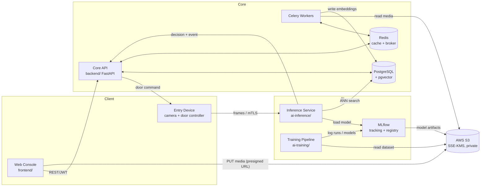
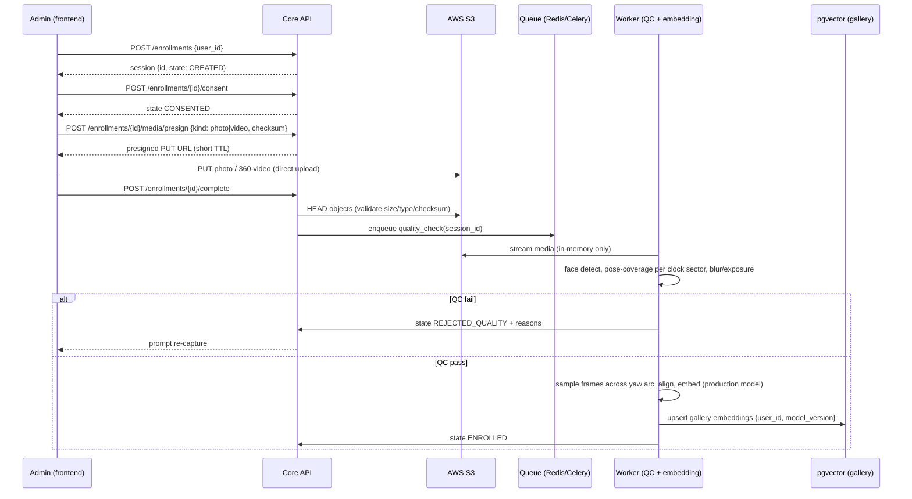
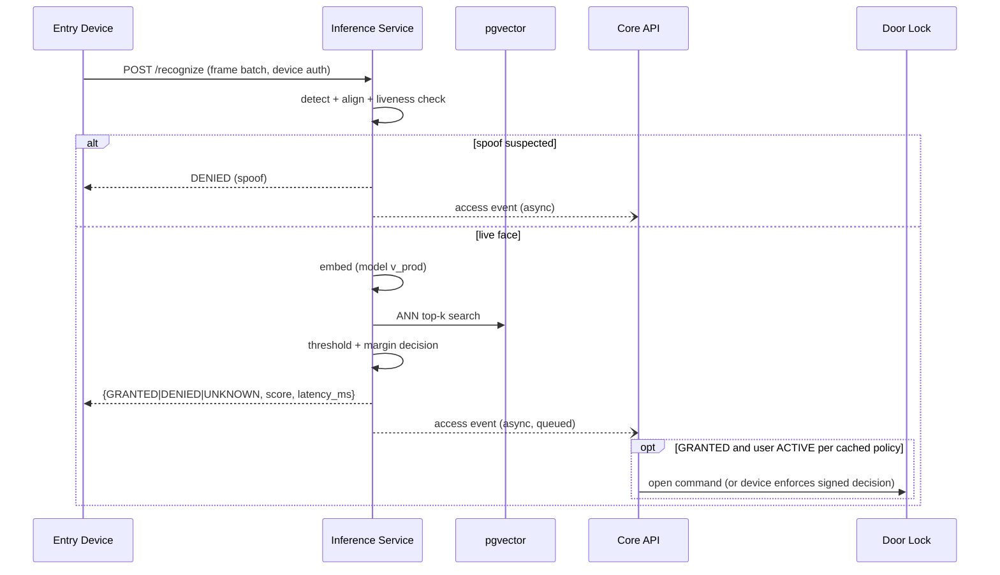
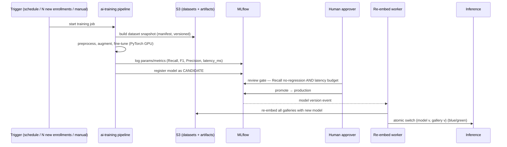

# TSD — Face Recognition Access Control

> Technical Specification Document. Status: DRAFT v0.1 (planning phase — no code exists yet).
> Requirement IDs (FR-*/NFR-*/ASM-*) reference `documentation/fsd/FSD-AI.md`.

---

## 1. Architecture Overview

### 1.1 Components

| Component | Repo dir | Stack | Responsibility |
|---|---|---|---|
| Web Console | `frontend/` | React + TypeScript + Vite (proposed, ASM-11), MediaRecorder/WebRTC | Enrollment capture UI, user/device management, live monitoring dashboards |
| Core API | `backend/` | Python 3.12, FastAPI, Pydantic v2, SQLAlchemy + alembic, managed by `uv` | AuthN/Z, users, enrollment orchestration, presigned S3 URLs, devices, access events, policy decision, audit |
| Inference Service | `ai-inference/` | Python + PyTorch (MVP); optional Rust + ONNX Runtime/TensorRT (phase 2) | Detection → alignment → liveness → embedding → vector search → decision |
| Training Pipeline | `ai-training/` | Python + PyTorch (GPU), Pydantic, `uv` | Data engineering from S3, EDA, preprocessing, fine-tuning, evaluation, model registry publishing, gallery re-embedding |
| Workers | inside `backend/` + `ai-training/` | Celery workers | Async jobs: media QC, embedding extraction, cleanup/retention, notifications |
| QA | `qa/` | Python + Playwright, `uv` | E2E, API contract, model-regression gate |

### 1.2 Component & Data-Flow Diagram



### 1.3 Service Boundaries (rules)

- `frontend/` never talks to the DB or S3 credentials; it only calls Core API and uploads bytes to presigned S3 URLs.
- `ai-inference/` is the only service on the door-decision hot path; it must not call slow services synchronously (access-event writes are fire-and-forget via queue with local fallback buffer in memory).
- `ai-training/` never serves online traffic; it publishes versioned models to the registry, and gallery re-embedding is a job, not an API.
- `backend/` owns all business state (users, sessions, devices, events, consent, audit). AI services own no business tables — they read/write embeddings and models only.
- Media bytes NEVER transit or rest on service disks (NFR-SEC-02): browser → S3 direct; workers stream S3 objects into memory/`tmpfs` and delete immediately.

## 2. End-to-End Flows

### 2.1 Enrollment (FR-ENR)



### 2.2 Recognition at the Door (FR-INF)



Policy check on the hot path uses a Redis-cached snapshot of user status/door policy (TTL ≤ 30 s) so a DB outage does not block decisions; fail-secure if cache empty (FR-INF-05).

### 2.3 Training & Promotion (FR-TRN)



## 3. Tech Stack Decisions & Trade-offs

| Concern | Choice (v1) | Rationale | Trade-off / alternative |
|---|---|---|---|
| Relational DB | **PostgreSQL 16** | Mature, alembic-friendly, one engine for business data + vectors via pgvector | — |
| Vector store | **pgvector (HNSW)** in the same Postgres | ≤5k identities × ~50 embeddings ≈ trivial scale; one less system; transactional consistency with user status | If >100k identities or multi-site: migrate to **Qdrant** (better filtering + scale). Interface behind a `GalleryStore` abstraction from day 1. |
| Cache / broker | **Redis 7** | Session cache, policy snapshot cache, rate limits, Celery broker + result backend | Single point — run with replica; if job semantics grow complex, move broker to RabbitMQ |
| Async jobs | **Celery** (workers in backend & ai-training) | Standard Python, retries/DLQ, fits uv-managed services | Alternatives: Dramatiq (simpler), Kafka (overkill at this scale — no stream-processing need yet) |
| Experiment tracking + model registry | **MLflow (self-hosted, artifacts on S3)** | Free, self-hosted (biometric metadata stays in our infra), registry stages map to our promotion gate | W&B nicer UX but SaaS/external data residency concern for biometric project |
| Object storage | **AWS S3** (mandated) | Non-negotiable rule; SSE-KMS, versioning, lifecycle rules for retention | — |
| Inference serving | **FastAPI + PyTorch (TorchScript/`torch.compile`)** MVP; **ONNX Runtime, optionally Rust (axum + ort)** phase 2 | Ship correctness first; measure. Rust/ONNX cuts p95 latency and jitter if Python can't meet 300 ms | Rust adds build/hiring complexity; only justified by measured SLO miss |
| Face models (candidates, final per AI Researcher) | Detection: SCRFD/RetinaFace; Embedding: ArcFace-family (e.g., iResNet/AdaFace/TransFace); Liveness: passive PAD (e.g., MiniFASNet-class) | SOTA open implementations, fine-tunable, ONNX-exportable | Confirm licenses for commercial use — part of AI Researcher checklist |
| Frontend | React + TS + Vite, TanStack Query, MediaRecorder API | Camera capture maturity, ecosystem, team availability | Needs ratification (ASM-11) |
| Observability | OpenTelemetry + Prometheus/Grafana + Loki | Latency SLO (ms) is a first-class metric | Managed APM if ops budget allows |
| Deploy | Docker Compose (dev) → single-node k8s or ECS (prod), GPU node for training | Small footprint v1 | Decide with infra owner |

## 4. Data Design (high-level schema)

PostgreSQL, migrations via alembic (owned by `backend/`; `ai-training` gets read-only + embeddings-write role).

```
users(id, external_ref, full_name, status[ACTIVE|SUSPENDED|OFFBOARDED], created_at, ...)
staff_accounts(id, email, role[ADMIN|OPERATOR|VIEWER], oidc_sub, ...)
consents(id, user_id, consent_version, granted_at, revoked_at)
enrollment_sessions(id, user_id, state, qc_report jsonb, created_by, timestamps)
media_objects(id, session_id, kind[photo|video|event_frame], s3_bucket, s3_key,
              checksum, size, content_type, retention_expires_at)   -- metadata ONLY, no bytes
face_embeddings(id, user_id, session_id, model_version, pose_bucket, vector vector(512),
                created_at)          -- pgvector HNSW index (cosine)
models(version, mlflow_run_id, stage[CANDIDATE|PRODUCTION|RETIRED],
       recall, f1, precision, latency_ms_p95, promoted_by, promoted_at)
devices(id, name, door_group, auth_credential_ref, last_heartbeat_at, status)
access_policies(id, user_id|group_id, door_group, allowed, valid_from, valid_to)
access_events(id, device_id, decision, matched_user_id?, similarity, liveness_score,
              model_version, latency_ms, frame_media_id?, occurred_at)  -- partitioned by month
audit_logs(id, actor, action, entity, payload jsonb, at)  -- append-only
```

S3 layout (single private bucket, SSE-KMS, versioned):

```
s3://frac-media/
  enrollment/{user_id}/{session_id}/photo_{n}.jpg
  enrollment/{user_id}/{session_id}/rotation.webm
  events/{yyyy}/{mm}/{device_id}/{event_id}.jpg      (optional retention, short lifecycle)
  datasets/{snapshot_id}/manifest.json               (training snapshots = manifests, not copies)
  mlflow/ (artifacts)
```

Lifecycle rules implement ASM-10 (90-day raw-media expiry) and event-frame short retention. User deletion job (FR-ENR-09) deletes objects + embeddings + tombstones the user, and is audited.

## 5. Model & Metrics Specification

- Task: **1:N identification** (ASM-04). Gallery = multi-view embeddings per user from the 360° video (pose buckets by yaw sector derived from clock positions, e.g., 12 sectors; back-of-head frames discarded — ASM-03).
- Decision rule: cosine similarity top-1 with threshold τ and top-1/top-2 margin; τ tuned on validation to satisfy **Recall ≥ 0.98 @ FAR ≤ 0.1%** (ASM-07). Recall is the primary optimization target (FR-TRN-04); ties broken by F1, then Precision.
- Latency budget (NFR-PRF-01), measured and reported in **ms**: detection ≤ 40, liveness ≤ 60, embedding ≤ 50, ANN search ≤ 10, overhead ≤ 40 → decision p95 ≤ 300 ms on target hardware. Every `/recognize` response carries `latency_ms`; Prometheus histogram per stage.
- Evaluation protocol: frozen benchmark set (held-out identities + impostor set, augmented poses/lighting), versioned in S3; QA regression suite runs it on every candidate model (NFR-QA-01). Promotion gate: no Recall regression AND latency budget pass AND human approval (FR-TRN-05).
- Embedding-space consistency: gallery re-embedded on every model promotion; inference switches `{model_version, gallery_version}` atomically (blue/green) — no mixed-version matching (FR-TRN-06).

## 6. Security & Privacy Design

- **Classification**: face media + embeddings = sensitive personal data under UU PDP 27/2022; embeddings are treated as biometric data (they identify a person), not anonymous vectors.
- **Consent**: capture blocked until consent recorded (FR-ENR-08); consent text versioned; revocation triggers cleanup job (≤ 24 h, ASM-12).
- **At rest**: S3 SSE-KMS (customer-managed key), private bucket, block-public-access, TLS-only bucket policy; Postgres encrypted volume; embeddings column-level protection via restricted DB roles.
- **In transit**: TLS 1.2+ everywhere; devices use per-device credentials (mTLS or signed device tokens) with rotation; presigned URLs TTL ≤ 5 min, content-type + checksum constrained.
- **AuthZ**: staff OIDC + RBAC (ADMIN/OPERATOR/VIEWER); deny-by-default FastAPI dependencies; inference API accepts device principals only.
- **No-local-media enforcement**: code review checklist + QA test asserting no filesystem writes of media MIME types; workers use streaming/`tmpfs` with finally-block deletion; containers run with read-only root FS where possible.
- **Audit**: append-only `audit_logs` for enroll/revoke/threshold/model-promotion/deletion; access to media metadata itself is audited.
- **Anti-spoofing**: passive PAD on the hot path; spoof-suspected events flagged + operator alert (NFR-SEC-06). Known residual risk in v1: sophisticated 3D mask attacks (mitigation deferred to hardware liveness phase).
- **Threats considered**: presentation attack (PAD), stolen device credential (short-lived creds + revocation), S3 exfiltration (KMS + least-privilege IAM per service), embedding inversion research risk (restrict embedding read access; never expose vectors via API), insider misuse (RBAC + audit).

## 7. API Contracts (high-level; OpenAPI to be authored by backend-engineer)

Representative contracts — all JSON, all authenticated, errors follow RFC 9457 problem+json.

```
POST /api/v1/enrollments            {user_id} → 201 {id, state}
POST /api/v1/enrollments/{id}/consent  {consent_version} → {state: CONSENTED}
POST /api/v1/enrollments/{id}/media/presign
     {kind: "photo"|"video", content_type, size, sha256}
     → {upload_url, s3_key, expires_at}
POST /api/v1/enrollments/{id}/complete → 202 {state: QC_RUNNING}
GET  /api/v1/enrollments/{id} → {state, qc_report?, reasons?}
DELETE /api/v1/enrollments/{id} → 202 (revocation + cleanup job)

POST /api/v1/training/jobs {trigger, dataset_filter?} → 202 {job_id}
GET  /api/v1/training/jobs/{id} → {status, mlflow_run_id, metrics{recall,f1,precision,latency_ms_p95}}
POST /api/v1/models/{version}/promote → {stage: PRODUCTION}   (ADMIN/ML role)

POST /inference/v1/recognize   (ai-inference, device auth)
     multipart frames | base64 batch →
     {decision: "GRANTED"|"DENIED"|"UNKNOWN",
      user_id?, similarity, liveness_score, model_version, latency_ms}

GET  /api/v1/access-events?device_id&decision&from&to → paged list
GET  /api/v1/stream/access-events   (SSE) → live events
POST /api/v1/devices {name, door_group} → {id, credential_bootstrap}
POST /api/v1/devices/{id}/heartbeat → 204
```

## 8. Impact Analysis

| Area | Impact | Mitigation |
|---|---|---|
| Technical | Two hard SLOs collide: Recall-first thresholds increase false-accept pressure; latency budget limits model size | Threshold tuning with FAR bound (ASM-07); ONNX/Rust escape hatch; per-stage latency histograms from day 1 |
| Biometric security | Breach of media/embeddings is irreversible for victims (faces can't be rotated like passwords) | KMS encryption, least-privilege IAM, no vector egress via API, short retention of raw media, audit |
| Privacy/legal | UU PDP sensitive-data obligations: consent, purpose limitation, deletion, possible DPIA | Consent gating in the flow itself; deletion cascade job; recommend a DPIA before go-live (flagged to user) |
| Operational | Door availability depends on inference service; fail-secure means outages block entry | HA target 99.5%, operator manual override procedure, device heartbeats + alerting |
| Model ops | Every promotion forces full gallery re-embedding | Blue/green gallery versions; re-embed job sized for ≤5k users (minutes, not hours) |
| Org/process | QA gate before PR + human promotion gate add friction | Deliberate: biometric access control justifies human-in-the-loop |

## 9. Phasing (input for Project Manager)

1. **P0 — Foundations**: repo scaffolding, Postgres+pgvector, Redis, S3 bucket+IAM, auth, CI, QA harness.
2. **P1 — Enrollment vertical slice**: capture UI → presigned upload → QC → embedding → gallery (pretrained model, no fine-tuning yet).
3. **P2 — Inference vertical slice**: `/recognize` with pretrained model + liveness + events + dashboard; measure latency.
4. **P3 — Training pipeline**: dataset snapshots, fine-tuning, MLflow, promotion gate, gallery re-embedding.
5. **P4 — Hardening**: retention automation, audits, drift monitoring, load tests, optional Rust/ONNX optimization.

## 10. Open Items

- AI Researcher to deliver model shortlist + license check (`documentation/research/`), feeding §3 model rows.
- Door-controller hardware contract (ASM-02) — blocks P2 device integration details.
- Frontend stack ratification (ASM-11); UI/UX designer to spec the 360° capture guidance UX (the hardest screen).
- Infra decision: k8s vs ECS; GPU procurement for training.
- Confirm all ASM-01…ASM-12 with the user.
